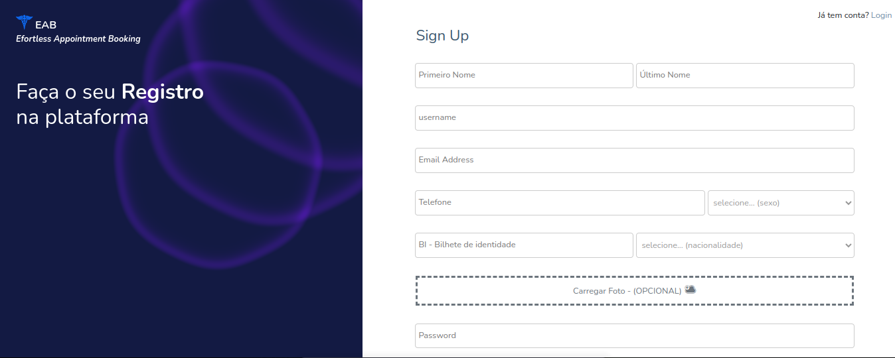

<div align="center">
  <h1>EFORTLESS APPOINTMENT BOOKING 🧑‍🔬</h1>
</div>
<br />
<!-- TABLE OF CONTENTS -->
<details>
  <summary>Table of Contents</summary>
  <ol>
    <li>
      <a href="#about-the-project">About The Project</a>
      <ul>
        <li><a href="#built-with">Built With</a></li>
      </ul>
    </li>
    <li>
      <a href="#getting-started">Getting Started</a>
      <ul>
        <li><a href="#prerequisites">Prerequisites</a></li>
        <li><a href="#installation">Installation</a></li>
      </ul>
    </li>
    <li><a href="#usage">Usage</a></li>
    <li><a href="#contributing">Contributing</a></li>
    <li><a href="#license">License</a></li>
    <li><a href="#contact">Contact</a></li>
  </ol>
</details>

<!-- ABOUT THE PROJECT -->
## About The Project
EAB is a website that allows you make a appointment booking for a hospital online and without efort. is an web aplication.

## why?
* The burocracy of many wealth institution is so hight about making a booking and interaction to gathering information they need a time.

## Features
* User Registration (POST|GET|PUT|DELETE) and authentication.
* Patient's Appointment Booking
* Dashboard Admin.
* Email Sending.
* Password Encryptation.
* File Uploads.
* Session Authentication.
* Docker Containerization.

### Built With

* PHP
* LARAVEL
* BOOTSTRAP
* MYSQL
* SESSION AUTH
* ELOQUENT ORM
* HTML|CSS|JAVASCRIPT
* DOCKER CONTAINERAZATION
<p align="right">(<a href="#readme-top">back to top</a>)</p>


<!-- GETTING STARTED -->
## Getting Started

### Prerequisites
Ensure your have installed on your machine: *Vscode, *node, *composer, *mysql properly.


### Installation
1. Clone the repo
   ```sh
   git clone https://github.com/marionorberto/EAB.git
   ```
2. Install all packages using composer
   ```sh
   composer install
   ```
3. Create the Mysql Database: 'eab'.

4. Create .env file and Change your local .env variable(see exemple file: .env.example).


5. run start script.
 ```sh
   php artisan serve
   ```

<p align="right">(<a href="#readme-top">back to top</a>)</p>


<!-- USAGE EXAMPLES -->
## Usage
* Register you in app:




* Login in application:


* Make a booking:


* Check your email confirmation:  


* Explore the app 😃

<p align="right">(<a href="#readme-top">back to top</a>)</p>


<!-- CONTRIBUTING -->
## Contributing
If you have a suggestion that would make this better, please fork the repo and create a pull request. You can also simply open an issue with the tag "enhancement".
Don't forget to give the project a star! Thanks again!

1. Fork the Project
2. Create your Feature Branch (`git checkout -b feature/AmazingFeature`)
3. Commit your Changes (`git commit -m 'Add some AmazingFeature'`)
4. Push to the Branch (`git push origin feature/AmazingFeature`)
5. Open a Pull Request

<p align="right">(<a href="#readme-top">back to top</a>)</p>

<!-- LICENSE -->
## License
Distributed under the MIT License.


## Contact
Mário Norberto - [@linkedin.com/in/marionorberto](https://linkedin.com/in/marionorberto) - marionorberto2018@gmail.com

Project Link: [https://github.com/marionorberto/EAB](https://github.com/marionorberto/EAB)

<p align="right">(<a href="#readme-top">back to top</a>)</p> 
